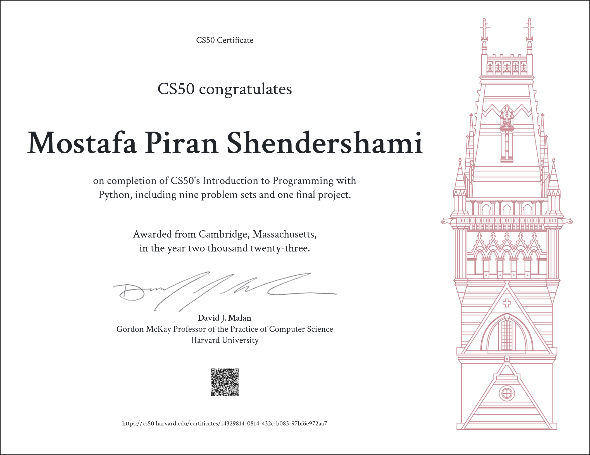

# CS50P_2023
 My personal experience in taking this course

## :warning: Disclaimer:

### ❗ **The following codes are for educational purposes only and not intended to be used/submitted as your own solutions.**

### ❗ **Cheating violates the [Academic Honesty](https://cs50.harvard.edu/python/2022/honesty/) of the course, not to mention it's totally pointless if you actually want to learn programming.**

 

